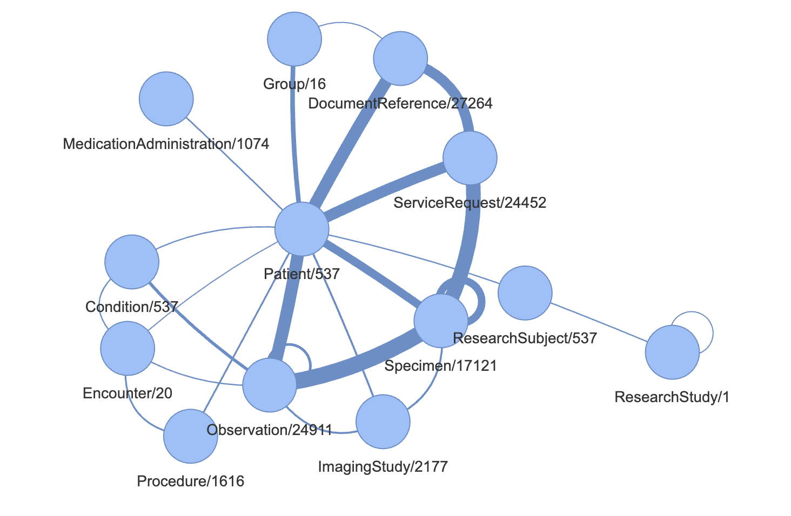

# healthcare-api
Devops for Google's healthcare-api
See [technical article](https://kellrott.medium.com/using-google-fhir-to-support-research-8f726834d77)

## Setup

How the healthcare API and FHIR store was created.

* setup environment
```bash
# see .env-sample and setup the environment variables
# collaborators will need to setup their own .env file
export $(cat .env | xargs)

export GOOGLE_PROJECT=$(gcloud projects list --filter=name=$GOOGLE_PROJECT_NAME --format="value(projectId)")
echo $GOOGLE_PROJECT
gcloud config set project $GOOGLE_PROJECT
```
* create the dataset and FHIR store
```bash
gcloud auth application-default set-quota-project $GOOGLE_PROJECT

gcloud services enable healthcare.googleapis.com

export GOOGLE_SERVICE_ACCOUNT=$(gcloud projects get-iam-policy $GOOGLE_PROJECT --format="value(bindings.members)" --flatten="bindings[]" | grep serviceAccount | uniq | grep healthcare)

gcloud healthcare datasets create $GOOGLE_DATASET --location=$GOOGLE_LOCATION

gcloud beta healthcare fhir-stores create $GOOGLE_DATASTORE --dataset=$GOOGLE_DATASET --location=$GOOGLE_LOCATION --version R4 --enable-update-create
```
* View the [FHIR store](https://console.cloud.google.com/healthcare/fhirviewer)


## Transform data


* R5 to R4
The Google Healthcare API only supports R4, so we need to transform the data from R5 to R4.
[R5 support expected first half of 2025](https://groups.google.com/g/gcp-healthcare-discuss/c/DAua7sqmSl8/m/h1-nnpClBwAJ)

Note: The transformation is based on the differences between R5 and R4 observed in the TCGA data.
See scripts/README-transform.md for details.

```bash

# setup venv
python -m venv venv
source venv/bin/activate
pip install -r requirements.txt

# transform a resource
python scripts/transform.py --input-ndjson MY-R5-PROJECT/META/RESOURCE-NAME.ndjson --output-ndjson MY-R4-PROJECT/META/RESOURCE-NAME.ndjson

```

* Create `Assay` resources
See the scripts/README-assay.md for details on how to create `Assay` resources that link 0..* Specimen or Patient resources to DocumentReference resources.

##### Order of operation for transforming data: 
After setup, start by generating the Assay.ndjson file. Next, transform the entity ndjson files from R5 to R4. For entity files that do not require transformation, simply transfer them directly to the new R4 project folder.


## Import data

For full documentation, see [here](https://cloud.google.com/healthcare-api/docs/how-tos/fhir-import-export#importing_fhir_resources)

```bash
# upload to the bucket
scripts/upload.sh MY-R4-PROJECT/META TCGA-PROJECT

# note: there maybe an issue with gcloud package. This may be a workaround:
CLOUDSDK_PYTHON=python3.10 scripts/upload.sh MY-R4-PROJECT/META TCGA-PROJECT
```


```bash
#  the base URL for the FHIR store
export FHIR_BASE=https://healthcare.googleapis.com/v1beta1/projects/$GOOGLE_PROJECT/locations/$GOOGLE_LOCATION/datasets/$GOOGLE_DATASET/fhirStores/$GOOGLE_DATASTORE

# Issue an import request, using the publicly available data and your google credentials
# Wildcard or individual files can be imported
curl -X POST \
    -H "Authorization: Bearer $(gcloud auth application-default print-access-token)" \
    -H "Content-Type: application/json; charset=utf-8" \
    --data '{
      "contentStructure": "RESOURCE",
      "gcsSource": {
        "uri": "gs://fhir-aggregator-public/TCGA-PROJECT/META/*.ndjson"        
      }
    }' "https://healthcare.googleapis.com/v1beta1/projects/$GOOGLE_PROJECT/locations/$GOOGLE_LOCATION/datasets/$GOOGLE_DATASET/fhirStores/$GOOGLE_DATASTORE:import"

```

## Populated data


## Query the data

```bash

curl \
    -H "Authorization: Bearer $(gcloud auth application-default print-access-token)" \
    $FHIR_BASE'/fhir/Patient?_total=accurate&_count=0'
```
[Advanced FHIR search features](https://cloud.google.com/healthcare-api/docs/how-tos/fhir-advanced-search)